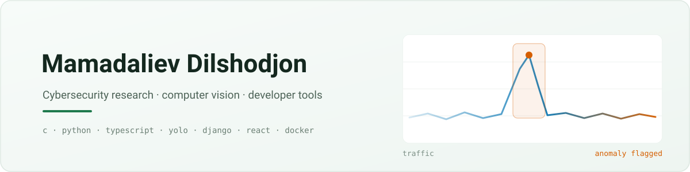

<div align="center">

<picture>
  <source media="(prefers-color-scheme: dark)" srcset="assets/header-dark.svg">
  
</picture>

<a href="https://github.com/DilshodbekMX?tab=repositories"></a>
<a href="https://github.com/DilshodbekMX?tab=followers"></a>
<a href="https://github.com/DilshodbekMX/folio"></a>


</div>

---

## 👋 About

I work on **network security research** and build the tools that research needs. Lately that means
an evaluation protocol for training-free DDoS detection, and a LaTeX editor good enough to write the
paper in. Before that, several years of **computer vision**: fire and smoke detection running on
Raspberry Pi hardware, YOLO models exported to ONNX, and the web and desktop apps around them.

```text
  research  ·  detection methodology, evaluation protocols, reproducible results
  vision    ·  YOLOv5 / YOLOv8, ONNX, OpenCV, real-time detection on small devices
  building  ·  TypeScript + React fronts, Django / Node backends, Docker, C where it counts
```

## 🧭 What I am building now

<table>
<tr>
<td width="50%" valign="top">

### 📝 [Folio](https://github.com/DilshodbekMX/folio)
A self-hosted, real-time collaborative **LaTeX editor**. Live co-editing with named cursors,
compiles in a sandboxed TeX Live 2026 container, SyncTeX both ways, and every version kept in git.

`TypeScript` `React` `Yjs` `CodeMirror` `pdf.js` `Docker`

</td>
<td width="50%" valign="top">

### 🛡️ [AntiDDoS-Shield](https://github.com/DilshodbekMX/AntiDDoS-Shield)
Detection work in **C**, plus the evaluation deposit behind my manuscript *An Evaluation Protocol
for Training-Free DDoS Detection*: runners, a baseline registry and checksummed result records.

`C` `evaluation protocols` `reproducibility`

</td>
</tr>
<tr>
<td width="50%" valign="top">

### 🧠 [MindMapper](https://github.com/DilshodbekMX/MindMapper)
An **XMind-style mind-map** app for tracking what you are learning: several map structures, undo
and redo, themes, import from JSON or OPML, and a desktop build.

`React` `React Flow` `Express` `SQLite` `Electron`

</td>
<td width="50%" valign="top">

### 🔥 [EarlyFireDetection](https://github.com/DilshodbekMX/EarlyFireDetection)
Fire and smoke detection in three parts: a **Raspberry Pi** detector, a desktop app for the
cameras, and a site showing the statistics. Alerts go to the nearest fire station.
See also [FireSmokeHelper](https://github.com/DilshodbekMX/FireSmokeHelper) and
[Yolov5-ONNX](https://github.com/DilshodbekMX/Yolov5-ONNX).

`Python` `YOLOv8` `ONNX` `Django` `Raspberry Pi`

</td>
</tr>
</table>

<details>
<summary><b>Earlier work</b></summary>
<br>

| Project | What it is |
|---|---|
| [FerPIGuardSystem](https://github.com/DilshodbekMX/FerPIGuardSystem) | Android app, Java and Gradle |
| [ML](https://github.com/DilshodbekMX/ML) · [GoogleColab](https://github.com/DilshodbekMX/GoogleColab) | Notebooks: cleaning, feature selection, normalisation |
| [loop_attendance](https://github.com/DilshodbekMX/loop_attendance) · [Workers_Attendance](https://github.com/DilshodbekMX/Workers_Attendance) | Attendance systems for a school and for workplaces |
| [Login-With-Firebase](https://github.com/DilshodbekMX/Login-With-Firebase) · [Floating-Bottom-Navigation-Bar](https://github.com/DilshodbekMX/Floating-Bottom-Navigation-Bar) | Android components in Java |
| [Telegram-autoresponder](https://github.com/DilshodbekMX/Telegram-autoresponder) · [wordhippo-scrapping](https://github.com/DilshodbekMX/wordhippo-scrapping) | Automation and scraping in Python |

</details>

## 🧰 Tools

<p>


</p>
<p>


</p>
<p>


</p>

## 📊 By the numbers

<!-- assets/metrics*.svg are regenerated daily by .github/workflows/metrics.yml -->
<div align="center">





</div>

<!-- The snake is redrawn daily by .github/workflows/snake.yml and lives on the `output` branch -->
<picture>
  <source media="(prefers-color-scheme: dark)" srcset="https://raw.githubusercontent.com/DilshodbekMX/DilshodbekMX/output/snake-dark.svg">
  
</picture>

## 📫 Contact

<a href="mailto:dilshodbekpnu@gmail.com"></a>
<a href="https://github.com/DilshodbekMX?tab=repositories"></a>
